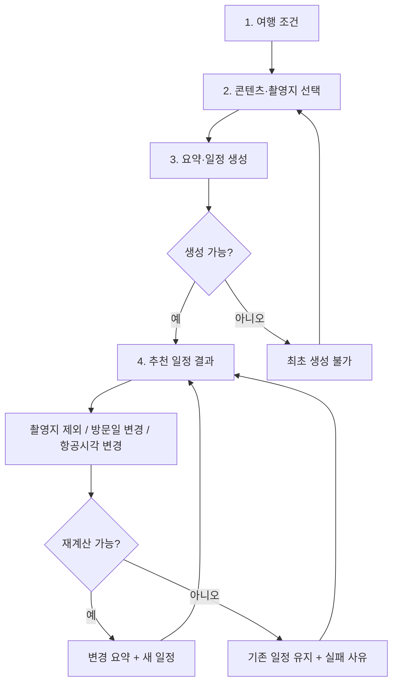

# 씬나로(SCENARO) 와이어프레임 가이드 v0.1

> 작성일: 2026-08-07<br>
> 대상: UX/UI 디자인 담당, 프론트엔드 구현 담당<br>
> 기준 문서: `docs/PRD.md`, `docs/ENGINE_SPEC.md`, GitHub 이슈 #14 최종 결정<br>
> 시각 기준: `03_예선발표_3분_최종.html`

## 1. 이 문서의 목적

이 문서는 디자인 담당자가 추가 기획 없이 씬나로 P0 화면과 주요 예외 상태의 시안을 그릴 수 있도록 화면 흐름, 정보 위계, 컴포넌트, 상태, 문구와 상호작용을 고정한다.

와이어프레임은 다음 질문에 답해야 한다.

1. 사용자는 항공 일정과 K-콘텐츠 취향을 어떤 순서로 입력하는가?
2. 후보 촬영지 중 필수 방문 장소를 어떻게 지정하는가?
3. 시스템이 만든 일정과 시간표의 근거를 어떻게 이해하는가?
4. 조건 변경 후 무엇이 바뀌었는지 어떻게 확인하는가?
5. 불가능한 일정에서 무엇을 수정해야 하는지 어떻게 아는가?

이 문서는 로고 리디자인, 새로운 브랜드 콘셉트, 상세 일러스트 제작을 요구하지 않는다. 시각 디자인은 예선 발표자료의 언어를 웹서비스에 맞게 확장한다.

**화면 계약의 단일 기준 문서는 이 가이드다.** API 명세는 데이터·액션 계약만 정의하고 화면 구성·배지·문구는 이 가이드를 참조한다. 같은 내용을 다루는 이전 와이어프레임 문서는 병행 기준으로 사용하지 않는다.

## 2. 제품을 한 문장으로 이해하기

> 입출국 항공편과 K-콘텐츠 취향을 바탕으로, 실제 열차 시간표와 검증된 촬영지 운영정보 안에서 실행 가능한 지역관광 일정을 만들고 조건 변경 시 전체를 다시 계산하는 웹서비스.

화면이 강조할 가치는 세 가지다.

- **가능성:** 실제 시간표와 시간 경계 안에서 갈 수 있는 장소만 제안한다.
- **선택권:** 시스템은 추천하지만 필수 장소와 대체 시간표는 사용자가 고른다.
- **설명 가능성:** 추천·제외·변경·실패 이유를 숨기지 않는다.

## 3. 범위와 우선순위

### 3.1 P0 시안에 반드시 포함

- 항공편·여행기간 입력
- 배우·작품 통합 검색
- 작품·촬영지 후보 확인과 필수 방문 선택
- 조건 요약과 일정 생성
- 일자별 철도 기반 일정 결과
- 촬영지 제외, 방문일 변경, 항공편 시각 변경
- 변경 전후 요약
- 검색 결과 없음, 생성 불가, 재계산 실패와 기존 일정 유지
- 운영시간·접근시간 추정치·출처·검증일 표시
- 항공 API 실패 또는 네트워크 단절 시 스냅샷 사용 고지

### 3.2 P0 설계에 자리만 확보하고, 상호작용은 P1

- 추천 시간표 1개 아래의 검증된 대안 2개
- `다른 가능한 시간표` 접기·펼치기와 일정 교체
- 결과 화면 중심 영어 전환

P0 와이어프레임에는 대안 시간표의 접힌 상태와 펼친 상태를 모두 그린다. 실제 구현 활성화는 P0 E2E 완료 후 판단한다.

### 3.3 P1 이후

- 드래그 앤 드롭으로 방문일 변경 또는 장소 제외
- 체류시간 직접 숫자 입력
- 같은 날 내부 방문 순서 수동 변경

버튼 편집은 드래그 앤 드롭이 추가되어도 계속 제공한다. 같은 날 내부 방문 순서는 엔진 영역이므로 드래그 대상이 아니다.

## 4. 발표자료에서 계승할 디자인 언어

### 4.1 전체 인상

- 공공 교통서비스의 신뢰감과 여행서비스의 가벼움을 함께 유지한다.
- 지도보다 **시간·열차·장소·변화**가 먼저 읽혀야 한다.
- 장식보다 카드 간 관계와 상태 변화가 중심이다.
- 넓은 흰색 면, 얇은 선, 작은 그림자, 절제된 상태색을 사용한다.

### 4.2 기관 CI 기반 색상 원칙

서비스의 색상은 코레일과 인천국제공항공사의 역할이 화면에서도 구분되도록 사용한다.

- **철도·추천 경로:** 코레일 블루 계열
- **항공·입출국 시간 경계:** 인천공항 틸·블루 계열
- **항공에서 철도로 이어지는 연결:** 인천공항 오렌지를 작은 포인트로만 사용
- **성공·주의·오류:** 기관 색과 구분되는 상태 토큰과 아이콘·문구를 함께 사용

CI 기준색:

| 기관 | 색상 | 값 | 근거와 용도 |
|---|---|---:|---|
| 코레일 | KORAIL Blue | `#005BAC` | 공식 WEB 색상. 주요 CTA, 추천 열차, 철도 이동선 |
| 코레일 | KORAIL Light Blue | `#00B2E3` | 공식 WEB 색상. 철도 보조정보, 선택 강조 |
| 코레일 | KORAIL Gray | `#77777A` | 공식 WEB 색상. 철도 관련 중립 보조정보 |
| 인천공항 | Airport Teal | 약 `#00ABB3` | 공식 CI JPG에서 추출한 근사값. 항공편 카드와 입출국 경계 |
| 인천공항 | Airport Blue | 약 `#5686C4` | 공식 CI JPG에서 추출한 근사값. 공항 관련 보조 UI |
| 인천공항 | Airport Orange | 약 `#FA9D1C` | 공식 CI JPG에서 추출한 근사값. 항공→철도 연결 포인트 |
| 인천공항 | Airport Gray | 약 `#5E6167` | 공식 CI JPG에서 추출한 근사값. 공항 관련 중립 보조정보 |

코레일 값은 [한국철도공사 공식 색상시스템](https://info.korail.com/info/contents.do?key=720)에 명시된 WEB 색상이다. 인천공항 공식 페이지는 HEX 값을 텍스트로 제공하지 않으므로 [인천국제공항공사 공식 CI JPG](https://www.airport.kr/sites/co_ko/down/IIAC_jpg01.jpg)의 픽셀을 기준으로 근사했다. 별도 CI 매뉴얼을 제공받으면 인천공항 값은 해당 수치로 교체한다.

실제 UI 토큰:

| 역할 | 값 | 사용 원칙 |
|---|---:|---|
| Rail primary | `#005BAC` | 주요 CTA, 추천 열차, 철도 이동선, 링크 |
| Rail secondary | `#00B2E3` | 철도 보조정보와 선택 강조 |
| Airport primary | 약 `#00ABB3` | 항공편, 입국·출국, 공항 시간 경계 |
| Airport secondary | 약 `#5686C4` | 공항 관련 비활성·보조 요소 |
| Connection accent | 약 `#FA9D1C` | 항공→철도 연결 표시. 넓은 면·경고색으로 사용 금지 |
| Deep blue | `#003B73` | 브랜드명, 화면 제목, 강한 정보 제목 |
| Navy | `#0E2038` | 어두운 강조 화면 또는 데모 백업 화면 |
| Text | `#172033` | 본문과 주요 수치 |
| Text secondary | `#5D6B7F` | 설명, 라벨, 부가정보 |
| Text tertiary | `#8A96A8` | 검증일, 출처, 도움말 |
| Line | `#E1E6EE` | 카드·입력 테두리, 구분선 |
| Line strong | `#CBD3E0` | 비활성 선택 요소, 강조 구분선 |
| Success green | `#2E7D32` | 실행 가능, 유지, 추가 성공 |
| Warning amber | `#B54708` | 변경됨, 확인 필요, 추정치. 아이콘·문구 필수 |
| Error red | `#D92D20` | 하드 제약 실패, 불가능, 놓친 열차 |
| Page background | `#EDF0F5` | 앱 배경 |
| Card | `#FFFFFF` | 주요 콘텐츠 면 |

상태색은 단독으로 의미를 전달하지 않는다. 아이콘, 제목 또는 배지를 함께 사용한다.

화면 대부분은 흰색·회색 중립색으로 유지하고, 코레일 블루는 주요 행동과 철도 정보에, 인천공항 틸은 항공 정보에만 배치한다. 인천공항 오렌지는 장식·연결 포인트로 제한해 경고 상태와 혼동되지 않게 한다.

기관 로고 자체를 사용할 때는 별도 허가 범위를 확인한다. 인천국제공항공사는 [공식 CI 안내](https://www.airport.kr/co_ko/573/subview.do)에서 기관상징의 무단 사용을 경고하고 있으므로, 허가 전에는 로고를 임의로 변형하거나 서비스 로고처럼 사용하지 않는다.

### 4.3 타이포그래피

- 기본 글꼴: **Pretendard**.
- 영문·숫자도 같은 글꼴을 우선 사용한다.
- 시간과 수치는 tabular numerals 적용을 권장한다.
- 제목은 굵고 짧게, 설명은 중립적이고 구체적으로 작성한다.

권장 웹 스케일:

| 용도 | 크기/굵기 |
|---|---|
| 페이지 제목 | 28–32px / 800 |
| 섹션 제목 | 20–24px / 700–800 |
| 카드 제목 | 16–18px / 700 |
| 본문 | 14–16px / 400–600 |
| 중요 수치·시간 | 16–20px / 700–800 |
| 라벨·출처 | 11–13px / 400–600 |

### 4.4 형태와 간격

- 카드 모서리: 10px.
- 입력·선택 박스: 8px.
- 칩·배지: 완전한 pill 또는 20px 이상 radius.
- 카드 테두리: 1px `#E1E6EE`.
- 선택·성공 카드: 1.5–2px 상태색 테두리.
- 기본 간격 단위: 4px. 주요 간격은 8, 12, 16, 24, 32px 사용.
- 그림자는 발표자료처럼 약하게 사용하고, 떠 있는 모달·토스트에만 한 단계 강하게 적용한다.

### 4.5 발표자료 컴포넌트의 웹 변환

| 발표자료 요소 | 서비스 화면에서의 역할 |
|---|---|
| 상단 `입국/출국/이동 가능` 칩 | 인천공항 틸 기반 여행 시간 경계 요약 |
| 작품·배우 segmented control | 통합 검색 결과의 유형 필터 |
| 후보 촬영지 목록 | 장소 선택 카드 목록 |
| DAY 1–3 카드 | 일자별 일정 타임라인 |
| 코레일 블루 열차 선택 카드 | 추천 시간표와 철도 경로 |
| 가는 선·작은 화살표의 인천공항 오렌지 | 항공에서 철도로 이어지는 연결 |
| 녹색 테두리·배지 | 실행 가능 또는 새로 추가된 일정 |
| 주황 테두리·배경 | 조건 변경으로 이동·수정된 일정 |
| 빨간 배너·취소선 | 불가능 또는 놓친 시간표 |

### 4.6 이미지 사용

- 와이어프레임 단계에서는 배우·작품·장소 이미지를 회색 placeholder로 표시해도 된다.
- 작품/배우 검색 결과의 이미지 비율은 2:3, 촬영지 이미지는 16:9를 권장한다.
- 일정 결과에서는 사진이 시간표와 시각 정보를 밀어내지 않도록 작은 썸네일 또는 접힌 상세에 배치한다.
- 사용 권한이 확인되지 않은 드라마 스틸컷이나 배우 사진을 최종 시안의 필수 자산으로 전제하지 않는다.
- 이미지가 없어도 작품명, 장소명, 관계와 검증 상태만으로 모든 흐름이 동작해야 한다.

## 5. 기준 화면과 반응형 범위

### 5.1 우선 제작 크기

1. **Desktop primary:** 1440×900.
2. **Demo safety:** 1280×720에서도 핵심 입력과 결과 요약이 첫 화면에 보이는지 확인.
3. **Mobile reference:** 390×844 한 장씩. P0 구현의 최우선은 아니지만 구조가 깨지지 않는지 확인.

### 5.2 기본 그리드

- 데스크톱 최대 콘텐츠 폭: 1200–1280px.
- 좌우 여백: 32px 이상.
- 입력 단계: 중앙 760–880px 단일 컬럼.
- 결과 단계: 왼쪽 260–320px 조건 요약 + 오른쪽 유동형 일정 영역의 2컬럼.
- 1024px 미만: 조건 요약을 상단 접이식 영역으로 올리고 일정은 단일 컬럼.

결과 화면에서 지도는 핵심이 아니다. 사용하더라도 보조 요약으로 제한하고, 열차와 일정 타임라인보다 큰 면적을 차지하지 않는다.

## 6. 확정 사용자 흐름



배우만, 작품만, 배우+작품 조합을 모두 허용한다. 배우는 최대 1명, 작품은 복수 선택할 수 있다. 선택 배우와 관련 없는 작품을 함께 고르는 조합은 P0에서 제외한다.

## 7. 전역 구조와 공통 컴포넌트

### 7.1 헤더

필수 요소:

- `씬나로 SCENARO` 워드마크
- 짧은 설명: `철도×항공 한류관광 일정 설계`
- 현재 언어 표시. P0에서는 `한국어` 고정이어도 위치는 확보
- 결과 화면에서는 `처음부터` 또는 `조건 수정` 동선

헤더는 발표자료의 작은 브랜드 블록처럼 차분하게 유지한다. 큰 마케팅 내비게이션은 만들지 않는다.

### 7.2 3단계 스테퍼

1. 여행 조건
2. 콘텐츠·촬영지
3. 확인·생성

완료 단계는 체크, 현재 단계는 파랑, 이후 단계는 회색으로 표시한다. 결과 화면에서는 스테퍼를 숨기고 여행 조건 요약으로 대체한다.

### 7.3 여행 시간 경계 칩

발표자료의 상단 칩을 계승한다.

- 입국: `KE904 · 8/12 10:15`
- 이동 가능: `11:45`
- 출국: `KE901 · 8/14 18:00`
- 출국 안전 여유: `120분`

항공시각이 변경되면 이전 값은 취소선, 새 값은 주황 강조로 표시한다.

### 7.4 상태 배지

| 상태 | 라벨 예시 | 색상 |
|---|---|---|
| 검증됨 | `운영시간 검증` | Green |
| 공식 상시 개방 | `상시 개방 확인` | Green |
| 추정치 | `역에서 약 45분` | Amber/neutral |
| 확인 필요 | `운영시간 확인 필요` | Amber |
| 필수 방문 | `필수` | Blue |
| 일정 제외 | `자동 일정 제외` | Red/neutral |
| 스냅샷 사용 | `오프라인 시간표` | Neutral/blue |

## 8. 화면별 상세 명세

## WF-01. 여행 조건 입력

### 목적

입국부터 출국까지의 계산 경계를 만든다.

### 화면 구성

1. 페이지 제목: `한국에서 머무는 시간을 알려주세요`
2. 설명: `입출국 시각 안에서 실제로 탈 수 있는 열차와 방문 가능한 촬영지를 계산합니다.`
3. 입국편 카드
   - 날짜
   - 도착 시각
   - 편명 선택 또는 직접 입력
   - 공항 터미널
4. 착륙 후 이동 가능 시점
   - `90분`, `120분`, `직접 설정`
   - 와이어프레임 기본 선택은 보수적인 `120분`
5. 출국편 카드
   - 날짜
   - 출발 시각
   - 편명 선택 또는 직접 입력
   - 출국 안전 여유 `120분 고정` 안내
6. CTA: `콘텐츠 선택하기`

### 검증 상태

- 출국이 입국보다 빠름
- 같은 날이지만 이용 가능 시간이 너무 짧음
- 필수값 누락
- 항공 API 실패 시: `실시간 조회에 실패해 저장된 항공편 정보로 계속합니다.`

오류는 해당 필드 아래에 표시하고 CTA를 비활성화한다.

## WF-02. 배우·작품 검색 — 기본/검색 중

### 목적

여행 동기가 되는 배우 또는 작품을 한 화면에서 찾는다.

### 화면 구성

- 제목: `어떤 장면을 만나고 싶나요?`
- 통합 검색창 placeholder: `배우 또는 작품을 검색하세요`
- 유형 필터: `전체 / 배우 / 작품`
- 최근 또는 데모 추천: 김고은, 확정 작품 4편
- 선택 영역: 배우 1명, 작품 복수 chip

### 규칙

- 배우 결과에는 이름, 대표작, 검증 작품 수 표시.
- 작품 결과에는 제목, 연도, 배우, 검증 촬영지 수 표시.
- 배우를 선택하면 해당 배우의 작품을 바로 노출한다.
- 배우와 관련 없는 작품을 추가하려 하면 P0에서는 `선택한 배우의 작품만 함께 선택할 수 있어요.` 안내.

## WF-03. 검색 결과 없음

전체 페이지 오류가 아니라 검색 영역 안의 빈 상태로 그린다.

- 제목: `검색 결과가 없어요`
- 설명: `다른 이름이나 영문 제목으로 다시 검색해 보세요.`
- 보조: `현재 데모에서는 검증이 완료된 배우와 작품만 제공합니다.`
- 행동: 검색어 지우기, 추천 목록 보기

## WF-04. 촬영지 후보·필수 방문 선택

### 목적

검증된 장소를 비교하고 반드시 방문할 곳만 하드 제약으로 지정한다.

### 장소 카드 필수 정보

- 장소 한/영 명칭
- 연결 작품과 배우
- 권역과 최근접역
- `역에서 약 N분` 추정 접근시간
- 운영시간 또는 공식 상시 개방
- 출처 이름과 검증일
- 추천 이유 1문장
- `필수 방문으로 지정` 체크 또는 버튼

### 기본 상태

- 모든 연결 장소는 후보로 보이지만 `필수 아님`.
- 운영시간 미확인 장소는 별도 `확인 필요 후보` 그룹에 두고 자동 일정에 포함되지 않음을 명시.
- 필수 장소 개수 제한은 두지 않되 3개 이상부터 `필수 장소가 많으면 가능한 일정이 없을 수 있어요.` 보조 안내.

### 화면 하단 고정 요약

- 선택 배우·작품
- 후보 수
- 필수 장소 수
- CTA: `여행 조건 확인하기`

## WF-05. 조건 요약·일정 생성

### 목적

계산 전에 사용자가 입력과 고정 조건을 한 번에 검토한다.

### 요약 블록

- 입국·이동 가능·출국 경계 칩
- 선택 배우 0–1명과 작품 목록
- 필수 방문 장소
- 하루 최대 촬영지 수: 1/2/3 또는 제품 설정값
- 하루 일반 여유: 기본 120분, 제품에서 제공하는 선택값
- 출국 안전 여유: 120분 고정
- 데이터 기준일·스냅샷 사용 여부

### 정책 고지

> 촬영지별 역 접근시간 추정치와 보수적 버퍼를 적용합니다. 실제 현지 교통상황에 따라 달라질 수 있습니다.

CTA:

- Primary: `일정 만들기`
- Secondary: `촬영지 다시 선택`

## WF-06. 일정 생성 중

### 목적

계산 중임을 알리고 중복 요청을 막는다.

- 문구: `실제 열차 시간표와 촬영지 운영시간을 맞추고 있어요.`
- 단계 표현은 최대 3개만 사용:
  1. 가능한 촬영지 확인
  2. 열차 시간표 연결
  3. 출국 시간까지 검증
- 스켈레톤은 결과의 DAY 카드 구조를 미리 보여준다.
- 입력과 CTA는 비활성화한다.
- 2초 목표이므로 과도한 진행 애니메이션은 만들지 않는다.

## WF-07. 일정 생성 성공 — 추천 일정

### 목적

추천 일정의 실행 가능성, 시간표, 장소와 근거를 한 화면에서 이해한다.

### 데스크톱 구조

```text
┌──────────────────────────────────────────────────────────────┐
│ 헤더                    여행 시간 경계 칩 4개               │
├───────────────┬──────────────────────────────────────────────┤
│ 조건 요약     │ 추천 일정 · 실행 가능 배지                  │
│ 배우/작품     │ 선정 이유 한 문장                           │
│ 필수 장소     │ [다른 가능한 시간표 2개 ▼]                  │
│ 기준일/출처   ├──────────────────────────────────────────────┤
│ 조건 수정     │ DAY 1 카드 · 타임라인 · 열차 · 촬영지       │
│               │ DAY 2 카드 · 타임라인 · 열차 · 촬영지       │
│               │ DAY 3 카드 · 타임라인 · 열차 · 촬영지       │
└───────────────┴──────────────────────────────────────────────┘
```

### 결과 상단

- 제목: `추천 일정이 완성됐어요`
- 실행 가능 배지
- 선정 이유 예시: `선택 작품 촬영지 3곳을 포함하면서 철도 이동과 환승이 가장 적은 일정입니다.`
- 전체 요약: 촬영지 수, 철도 이동시간, 환승, 출국 여유
- 내부 comparisonKeys 숫자나 점수는 사용자 화면에 직접 표시하지 않는다.

### DAY 카드

- 날짜와 DAY 번호
- 시간순 타임라인
- 열차번호, 출발·도착역과 시각
- 역→장소 접근 추정시간
- 장소 체류와 역 복귀 예상
- 장소 카드의 `제외`, `방문일 변경`
- 출처·검증일은 기본적으로 한 줄, 상세는 접기 가능

## WF-08. 다른 가능한 시간표 — 접힘/펼침

### 접힌 상태

추천 일정 바로 아래 한 줄로 배치한다.

`다른 가능한 시간표 2개 보기  ▾`

### 펼친 상태

최대 2개만 표시한다. 대안은 전체 하드 제약을 통과한 완전한 일정이며, 개별 열차만 바꾼 것처럼 표현하지 않는다.

각 대안 카드:

- 출발 또는 귀환 열차 시각
- `현지 활용 가능 시간`
- 촬영지 수와 변경 여부
- 철도 이동시간·환승
- 출국 여유
- 추천안과의 차이 한 문장
- CTA: `이 시간표 선택`

예시:

```text
11:00 출발
현지 활용 가능 시간 2시간 · 촬영지 동일 · 출국 여유 180분
추천안보다 1시간 늦게 출발합니다.

12:00 출발
현지 활용 가능 시간 1시간 · 촬영지 1곳 적음 · 출국 여유 150분
늦게 출발하는 대신 방문 장소가 줄어듭니다.
```

여러 장소가 포함될 수 있으므로 일반 라벨은 `촬영지 체류시간`이 아니라 `현지 활용 가능 시간`을 사용한다. 특정 장소에 실제 배정된 시간이 계산된 경우에만 그 장소의 체류시간으로 표시한다.

## WF-09. 편집 3동작

### 촬영지 제외

- 장소 카드의 `제외` 클릭
- 확인 팝오버: `영진해변을 제외하고 전체 일정을 다시 계산할까요?`
- Primary: `제외하고 재계산`
- 취소 가능

### 방문일 변경

- 장소 카드의 `방문일 변경`
- 현재 여행 날짜만 선택지로 표시
- 선택 후 해당 장소를 그 날짜에 고정한다는 안내
- Primary: `변경하고 재계산`

### 항공편 시각 변경

- 결과 상단의 `항공편 변경`
- 입국·출국 카드 편집
- 이전/새 시각을 동시에 보여주고 Primary: `새 시각으로 재계산`

공통 규칙:

- 한 번에 하나의 변경만 처리.
- 처리 중 다른 편집 버튼 비활성화.
- 성공한 경우에만 결과 교체.
- 재계산 목표 2초.

## WF-10. 재계산 성공과 변경 전후 요약

결과 상단에 주황 계열 변경 배너를 배치한다.

예시:

> 입국편이 2시간 늦어져 첫날 열차와 촬영지 1곳이 변경됐습니다.

- 열차: `12:55` → `16:11`
- 촬영지: `영진해변 DAY 1` → `DAY 2`
- 현지 활용 가능 시간: `3시간` → `2시간`
- 출국 여유: `180분` → `150분`

P0에서는 이전 일정 전체를 나란히 복제하지 않는다. 바뀐 DAY 카드와 항목만 주황 배경·테두리로 표시하고, 새로 추가된 항목은 녹색, 빠진 항목은 취소선으로 표시한다.

변화가 없으면:

> 조건은 반영됐지만 일정 구성은 동일합니다.

## WF-11. 최초 생성 불가

일정 결과 대신 수정 행동이 있는 독립 상태로 보여준다.

### 공통 구조

- 제목: `이 조건으로는 가능한 일정을 만들 수 없어요`
- 한 문장 이유
- 문제가 된 장소 또는 시간 조건
- 사용자가 바꿀 수 있는 행동 1–2개
- Primary CTA는 수정할 단계로 직접 이동

### 사유별 문구

| 엔진 사유 | 사용자 제목 | 보조 설명 | Primary 행동 |
|---|---|---|---|
| `TRAIN_UNAVAILABLE` | `연결 가능한 열차가 없어요` | `선택 날짜와 권역을 연결하는 시간표가 없습니다.` | `촬영지 다시 선택` |
| `DEPARTURE_DEADLINE_EXCEEDED` | `출국편에 맞춰 돌아올 수 없어요` | `출국 안전 여유 120분을 지키면 마지막 일정이 시간 안에 들어오지 않습니다.` | `필수 장소 줄이기` |
| `ACTIVITY_WINDOW_MISMATCH` | `활동 가능 시간대가 맞지 않아요` | `검증된 운영시간과 보수적인 접근시간 기준으로 방문이 어렵습니다.` | `다른 장소 보기` |
| `USER_CONSTRAINT_INFEASIBLE` | `필수 조건을 모두 만족할 수 없어요` | 문제 장소와 고정 날짜를 구체적으로 표시 | `필수 조건 수정` |

개발용 사유 코드 문자열을 그대로 사용자에게 노출하지 않는다.

## WF-12. 재계산 실패 — 기존 일정 유지

이 상태는 WF-11과 다르게 기존 일정 전체를 그대로 남긴다.

- 실패한 편집 위치 또는 결과 상단에 빨간/주황 인라인 패널 표시.
- 제목: `변경 내용을 적용할 수 없어요`
- 설명: 구체적인 이유와 문제 장소.
- 명시 문구: `기존 일정은 그대로 유지했습니다.`
- Primary: `다른 조건으로 다시 시도`
- Secondary: `닫기`

편집 모달을 닫은 뒤에도 기존 일정이 선택된 상태임을 분명히 한다. 실패한 카드를 빈 상태나 반쯤 변경된 상태로 남기지 않는다.

## WF-13. 스냅샷·오프라인 상태

핵심 흐름을 막지 않는 상단 인라인 알림으로 처리한다.

- `실시간 항공편 조회가 어려워 저장된 정보로 계산했습니다.`
- `오프라인 시간표 · 기준일 2026-08-07`
- `다시 조회`는 제공할 수 있으나 자동 반복 요청은 하지 않는다.
- 일정 결과에는 데이터 기준일을 항상 남긴다.

## 9. 인터랙션과 상태 전환 규칙

| 사용자 행동 | 처리 중 | 성공 | 실패 |
|---|---|---|---|
| 일정 생성 | 입력 잠금, DAY 스켈레톤 | WF-07 | WF-11 |
| 장소 제외 | 해당 카드+편집 잠금 | WF-10 후 새 일정 | WF-12, 기존 일정 유지 |
| 방문일 변경 | 날짜 선택 닫고 편집 잠금 | WF-10 후 새 일정 | WF-12, 기존 일정 유지 |
| 항공시각 변경 | 이전/새 값 유지, 편집 잠금 | WF-10 후 새 일정 | WF-12, 기존 일정 유지 |
| 대안 시간표 선택 | 대안 영역 잠금 | 해당 전체 일정으로 교체 | 선택 유지, 이유 표시 |

뒤로 가기 또는 조건 수정 시 이미 입력한 값은 유지한다. 사용자가 실수로 브라우저 뒤로 가더라도 가능한 한 처음부터 다시 입력하게 만들지 않는다.

## 10. 정보·문구 작성 원칙

### 사용해야 하는 표현

- `역에서 약 45분 · 추정치`
- `검증된 운영시간`
- `보수적인 접근시간 기준`
- `현지 활용 가능 시간`
- `저장된 시간표 기준`
- `기존 일정은 그대로 유지했습니다`

### 피해야 하는 표현

- `실시간 현지 교통까지 반영`
- `절대 늦지 않는 일정`
- `정확한 택시 이동시간`
- `AI가 최적의 답을 보장`
- `운영시간 위반`처럼 실제 상황을 단정하는 표현

AI보다 데이터와 계산 근거가 먼저 보이게 한다. AI 설명이 있더라도 `왜 바뀌었는가`를 풀어주는 보조 문장으로만 사용한다.

## 11. 접근성과 사용성

- 본문 대비는 WCAG AA 수준을 목표로 한다.
- 작은 출처 텍스트도 11px 미만으로 내리지 않는다.
- 버튼과 선택 영역의 최소 터치 높이는 44px.
- 포커스 링을 제거하지 않는다.
- 상태는 색상 외에 아이콘·텍스트·테두리 패턴으로 함께 구분한다.
- 시간 선택과 장소 선택은 키보드만으로도 가능해야 한다.
- 드래그 앤 드롭이 추가돼도 동일 기능의 버튼을 유지한다.
- 로딩 애니메이션은 과도하게 반복하거나 번쩍이지 않는다.

## 12. 디자이너 산출물 요구사항

### 12.1 필수 프레임

| 프레임명 | 화면 |
|---|---|
| `D-01 Travel conditions` | WF-01 |
| `D-02 Content search` | WF-02 |
| `D-03 Search empty` | WF-03 |
| `D-04 Place selection` | WF-04 |
| `D-05 Review` | WF-05 |
| `D-06 Generating` | WF-06 |
| `D-07 Result recommended` | WF-07 |
| `D-08 Timetable alternatives open` | WF-08 |
| `D-09 Edit controls` | WF-09의 편집 3종 |
| `D-10 Recalculated result` | WF-10 |
| `D-11 Initial infeasible` | WF-11 |
| `D-12 Recalc failed` | WF-12 |
| `D-13 Snapshot notice` | WF-13 |

데스크톱 프레임을 먼저 완료한다. 모바일은 D-01, D-04, D-07, D-12 네 장을 우선 제작한다.

### 12.2 컴포넌트 세트

- Button: primary, secondary, text, destructive, loading, disabled
- Input: default, focus, filled, invalid, disabled
- Search result: actor, work, empty
- Chip: selected actor, selected work, time boundary
- Badge: verified, estimate, needs verification, required, snapshot
- Place card: default, required, unavailable, needs verification
- Train card: recommended, alternative, missed, selected
- DAY card: default, changed, success, infeasible
- Banner/alert: info, snapshot, changed, success, error
- Modal/popover: exclude, pin date, edit flight
- Skeleton: result header and DAY cards

### 12.3 프로토타입 연결

최소 클릭 흐름:

1. D-01 → D-02 → D-04 → D-05 → D-06 → D-07
2. D-07 → D-08 → 대안 선택 → D-07 변형
3. D-07 → 항공편 변경 → D-10
4. D-07 → 불가능한 방문일 변경 → D-12 → D-07
5. D-05 → 불가능한 필수 조건 → D-11 → D-04

## 13. 프론트엔드 전달 메모

- 이 가이드의 사용자 노출 문구는 모두 한국어 `ko` 기준값이다. 구현 시 하드코딩하지 않고 `lib/i18n` 번역 키로 등록하며, 번역 키 누락 검사 대상에 포함한다.
- 화면은 성공 응답일 때만 새 일정을 상태에 반영한다.
- 이전 결과와 새 결과의 비교는 UI/애플리케이션 계층에서 만든다.
- `comparisonKeys`는 사용자 점수판이 아니라 선정 이유 문장 생성 근거다.
- 사유 코드는 i18n 사용자 문구로 매핑한다.
- 서버 전용 JSON의 원문 출처를 클라이언트로 모두 노출하지 말고 표시용 출처 필드만 전달한다.
- `alternatives`는 추천 포함 최대 3개의 전체 일정 후보 구조를 전제로 한다. 엔진 명세와 실제 타입 반영 전까지 디자인 계약으로 취급한다.

## 14. 디자인 리뷰 체크리스트

- [ ] 첫 화면에서 서비스가 항공·철도·촬영지를 연결한다는 점이 이해되는가?
- [ ] 추천 일정과 사용자가 직접 고른 필수 조건이 구분되는가?
- [ ] 열차 시각과 장소 방문 시각이 혼동되지 않는가?
- [ ] 추천 시간표 1개와 대안 2개가 과도한 선택 부담 없이 보이는가?
- [ ] `현지 활용 가능 시간`의 의미가 특정 장소 체류시간으로 오해되지 않는가?
- [ ] 운영시간 미확인 장소가 자동 일정에 포함된 것처럼 보이지 않는가?
- [ ] 성공·변경·주의·실패가 색상 없이도 구분되는가?
- [ ] 재계산 실패 후 기존 일정이 유지됐다는 점이 명확한가?
- [ ] 출처·검증일·추정치가 작지만 찾을 수 있는 위치에 있는가?
- [ ] 1280×720 시연 환경에서 핵심 결과와 편집 버튼이 보이는가?
- [ ] P0와 P1 요소가 시안에서 구분돼 구현 범위를 오해하지 않는가?

## 15. 결정이 바뀔 때의 처리

이 문서와 PRD·엔진 명세·GitHub 최종 결정이 충돌하면 임의로 하나를 선택하지 않는다. 충돌 항목을 이슈로 기록하고, 제품 계약이 확정된 뒤 이 문서와 와이어프레임을 함께 갱신한다.

화면 구조·상태·문구·배지는 이 문서를 단일 기준으로 유지한다. API 명세는 이 내용을 복사해 별도 화면 계약을 만들지 않고, 필요한 화면 항목을 이 문서의 WF 번호와 절 번호로 참조한다.
